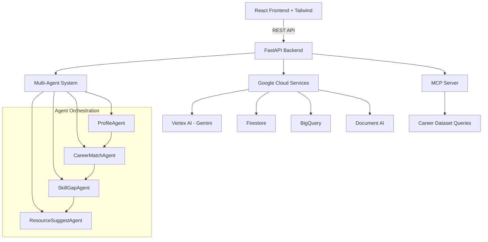

# Personalized AI Career Advisor

A multi-agent, AI-driven career guidance platform for students in India, built with FastAPI backend and React frontend.

## 🏗️ Architecture



## 🚀 Features

- **Multi-Agent AI System**: Specialized agents for profile analysis, career matching, skill gap analysis, and resource suggestions
- **Intelligent Career Matching**: AI-powered career recommendations based on skills, interests, and market demand
- **Resume Parsing**: Google Document AI integration for automatic resume analysis
- **Real-time Chat**: Interactive career guidance with Gemini AI
- **Skill Gap Analysis**: Visual charts showing skill gaps and learning paths
- **Resource Recommendations**: Personalized course, certification, and internship suggestions

## 🛠️ Tech Stack

### Backend
- **FastAPI** (Python) - High-performance API framework
- **Google Vertex AI (Gemini)** - AI reasoning and chat
- **Google Cloud Run** - Serverless deployment
- **Firestore** - User profiles and chat history
- **BigQuery** - Career datasets and analytics
- **Document AI** - Resume parsing
- **MCP (Model Context Protocol)** - Agent communication

### Frontend
- **React 18** with **Vite** - Modern development experience
- **Tailwind CSS** - Utility-first styling
- **Firebase Hosting** - Fast global CDN
- **Recharts** - Interactive data visualization
- **Firebase Auth** - Secure authentication

### DevOps & Testing
- **GitHub Actions** - CI/CD pipeline
- **Docker** - Containerization
- **Pytest** - Backend testing
- **Jest/RTL** - Frontend testing

## 📋 Prerequisites

- Node.js 18+
- Python 3.9+
- Google Cloud Project with billing enabled
- Firebase project

## 🚀 Quick Start

### 1. Clone Repository
```bash
git clone <your-repo-url>
cd ai-career-advisor
```

### 2. Backend Setup
```bash
cd backend
python -m venv venv
source venv/bin/activate  # On Windows: venv\Scripts\activate
pip install -r requirements.txt
cp .env.example .env
# Configure your .env file with Google Cloud credentials
uvicorn main:app --reload
```

### 3. Frontend Setup
```bash
cd frontend
npm install
cp .env.example .env
# Configure your .env file with Firebase credentials
npm run dev
```

### 4. Access Application
- Frontend: http://localhost:5173
- Backend API: http://localhost:8000
- API Documentation: http://localhost:8000/docs

## 🔧 Configuration

### Environment Variables

#### Backend (.env)
```env
GOOGLE_CLOUD_PROJECT=your-project-id
GOOGLE_APPLICATION_CREDENTIALS=path/to/service-account.json
FIRESTORE_DATABASE=your-firestore-database
BIGQUERY_DATASET=career_data
VERTEX_AI_LOCATION=us-central1
```

#### Frontend (.env)
```env
VITE_FIREBASE_API_KEY=your-api-key
VITE_FIREBASE_AUTH_DOMAIN=your-project.firebaseapp.com
VITE_FIREBASE_PROJECT_ID=your-project-id
VITE_FIREBASE_STORAGE_BUCKET=your-project.appspot.com
VITE_FIREBASE_MESSAGING_SENDER_ID=123456789
VITE_FIREBASE_APP_ID=your-app-id
VITE_API_BASE_URL=http://localhost:8000
```

## 🏗️ Project Structure

```
ai-career-advisor/
├── backend/                 # FastAPI backend
│   ├── agents/             # Multi-agent system
│   │   ├── base_agent.py   # Base agent class
│   │   ├── profile_agent.py
│   │   ├── career_match_agent.py
│   │   ├── skill_gap_agent.py
│   │   └── resource_suggest_agent.py
│   ├── api/                # API routes
│   ├── core/               # Core configurations
│   ├── models/             # Pydantic models
│   ├── services/           # Business logic
│   ├── main.py            # FastAPI application
│   ├── Dockerfile         # Container configuration
│   └── requirements.txt   # Python dependencies
├── frontend/               # React frontend
│   ├── src/
│   │   ├── components/    # Reusable components
│   │   ├── pages/         # Page components
│   │   ├── services/      # API services
│   │   └── utils/         # Utility functions
│   └── package.json
├── docs/                   # Documentation
│   ├── api.md             # API documentation
│   ├── deployment.md      # Deployment guide
│   └── schemas/           # Database schemas
├── .github/workflows/      # CI/CD pipelines
└── README.md
```

## 🤖 Multi-Agent Architecture

The system uses specialized AI agents that work together to provide comprehensive career guidance:

1. **ProfileAgent**: Collects and validates user data from resumes and forms
2. **CareerMatchAgent**: Queries BigQuery for career matches and ranks opportunities
3. **SkillGapAgent**: Analyzes missing skills and creates learning roadmaps
4. **ResourceSuggestAgent**: Recommends courses, certifications, and internships

Agents communicate through a centralized orchestrator using sequential and parallel patterns for optimal performance.

## 🧪 Testing

### Backend Tests
```bash
cd backend
pytest tests/ -v
```

### Frontend Tests
```bash
cd frontend
npm test
```

## 🚀 Deployment

### Automated Deployment
Push to `main` branch triggers automated deployment via GitHub Actions:
- Backend → Google Cloud Run
- Frontend → Firebase Hosting

### Manual Deployment

#### Backend to Cloud Run
```bash
cd backend
gcloud builds submit --tag gcr.io/PROJECT_ID/career-advisor-backend
gcloud run deploy --image gcr.io/PROJECT_ID/career-advisor-backend --platform managed
```

#### Frontend to Firebase
```bash
cd frontend
npm run build
firebase deploy
```

## 📊 Data Sources

- **Career Data**: Government job portals, industry reports
- **Skill Requirements**: Job postings, company requirements
- **Course Data**: MOOC platforms, certification providers
- **Salary Data**: Industry surveys, government statistics

## 🤝 Contributing

1. Fork the repository
2. Create a feature branch (`git checkout -b feature/amazing-feature`)
3. Commit your changes (`git commit -m 'Add amazing feature'`)
4. Push to the branch (`git push origin feature/amazing-feature`)
5. Open a Pull Request

## 📝 License

This project is licensed under the MIT License - see the [LICENSE](LICENSE) file for details.

## 💡 Hackathon Solution

This platform addresses the critical need for personalized career guidance in India by:

- **Democratizing Access**: Free, AI-powered career advice for all students
- **Localized Insights**: India-specific career data and market trends
- **Skill-First Approach**: Focus on practical skills over traditional qualifications
- **Scalable Solution**: Multi-agent architecture supports millions of users
- **Real-time Guidance**: Instant, personalized advice through AI chat

## 📞 Support

For support and questions, please open an issue or contact the development team.

---

Built with ❤️ for the future workforce of India

## Contribution Guide

1.  Fork the repository.
2.  Create a new branch (`git checkout -b feature/your-feature`).
3.  Make your changes.
4.  Commit your changes (`git commit -m 'Add some feature'`).
5.  Push to the branch (`git push origin feature/your-feature`).
6.  Open a pull request.

