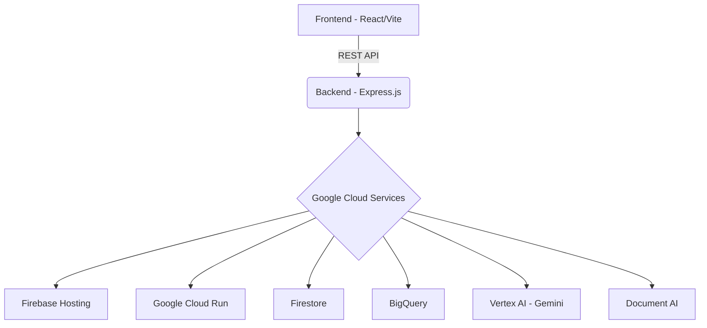

# Personalized AI Career Advisor

This is a full-stack web application that provides personalized career advice using AI.

## Architecture Diagram



## Local Setup

1.  **Clone the repository:**
    ```bash
    git clone <repository-url>
    cd Gen-AI-Hackathon
    ```

2.  **Backend Setup:**
    ```bash
    cd backend
    npm install
    cp .env.example .env # Create .env and add your credentials
    npm run dev
    ```

3.  **Frontend Setup:**
    ```bash
    cd frontend
    npm install
    cp .env.example .env # Create .env and add your Firebase credentials
    npm run dev
    ```

## Cloud Deployment

The application is set up for CI/CD using GitHub Actions.

-   The backend is deployed to **Google Cloud Run**.
-   The frontend is deployed to **Firebase Hosting**.

Refer to the `.github/workflows/deploy.yml` file for the deployment configuration.

## Contribution Guide

1.  Fork the repository.
2.  Create a new branch (`git checkout -b feature/your-feature`).
3.  Make your changes.
4.  Commit your changes (`git commit -m 'Add some feature'`).
5.  Push to the branch (`git push origin feature/your-feature`).
6.  Open a pull request.

